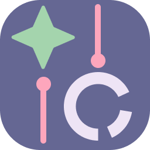

  

<h1 align="center">GalLogicx — StarSync v1.0</h1>

  <b>Эстетичная и мощная утилита для автоматической сортировки файлов.</b> 
  Наведите порядок в хаосе ваших папок одним движением.

---

### 🎨 Визуальное совершенство
**StarSync** — это полноценное приложение с глубокой кастомизацией:
*   **12 авторских тем оформления:** От глубокой «Бездны» до нежной «Сакуры».
*   **Динамический интерфейс:** Приятные дизайн, прогресс-бар.
*   **Drag-and-Drop:** Просто перетащите папку в окно программы - остальное сделает алгоритм.

### ⚙️ Возможности
- **Мультиязычность:** Полная поддержка **RU, EN, ES, ZH**.
- **Гибкая логика:** Сортировка по категориям (Фото, Видео, Документы и тд.) или по датам (День/Месяц/Год).
- **Интеллектуальный контроль:** Автоматическое переименование дубликатов (никакой потери данных).
- **Логирование:** Подробный отчет о каждом перемещенном файле.

  

---

### 🚀 Быстрый старт

#### Для пользователей:
1. Перейдите в раздел https://github.com/GalLogicx/StarSync.
2. Скачайте  StarSync.exe.
3. Запустите **StarSync.exe**. *Установка не требуется.*

#### Для разработчиков:
1. Клонировать репозиторий: https://github.com/GalLogicx/StarSync.
2. Установить зависимости
pip install -r requirements.txt
3. Запустить проект
python main.py

© 2026 **GalLogicx**. Сделано с любовью и звездами.✨

---

  

<h1 align="center">GalLogicx — StarSync v1.0</h1>

  <b>An aesthetic and powerful utility for automatic file sorting.</b> 
Bring order to the chaos of your folders with a single movement.

---

### 🎨 Visual Excellence
**StarSync** — is a full-fledged application with deep customization:
*   **12 custom themes:** From the deep "Abyss" to the delicate "Sakura".
*   **Dynamic Interface:** Pleasing design and progress bar.
*   **Drag-and-Drop:** Just drag a folder into the program window - the algorithm will do the rest.

### ⚙️ Features
- **Multilingual:** Full support for **RU, EN, ES, ZH**.
- **Flexible Logic:** Sorting by categories (Photos, Videos, Documents, etc.) or by dates (Day/Month/Year).
- **Intelligent Control:** Automatic duplicate renaming (no data loss).
- **Logging:** Detailed report on every moved file.

  

---

### 🚀 Quick Start

#### For Users:
1. Go to https://github.com/GalLogicx/StarSync
2. Download **StarSync.exe**.
3. Run the file. *No installation required.*

#### For Developers:
1. Clone the repository: https://github.com/GalLogicx/StarSync
2. Install dependencies:
pip install -r requirements.txt
3. Run the project:
python main.py

© 2026 **GalLogicx**. Made with love and stars. ✨

